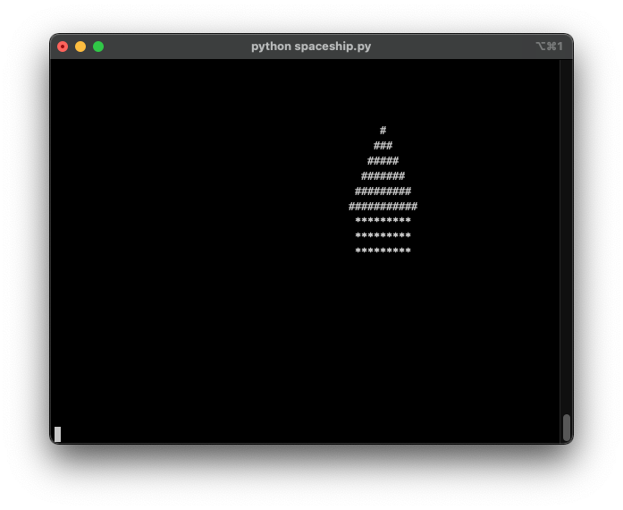

# leto_spaceship
When I first had a chance to play on a computer it was in the 6h grade.  There was 1 computer, in the library, and some of us would skip
lunch recess in order to build programs on it.  I have no idea what language we used (probably BASIC), nor could we save our programs.
So, at each lunchtime we'd rush in and code out our "spaceships" and watch them scroll up the screen!

This program is a bit more fancy than the spaceships of my youth.  (We can now have random widths, spacing between ships, and alignments on
the screen.)

A fun silly program that prints "spaceships" to the console.

---
Screenshot:

